# Project Thunderbolt

## Team Members
- Arnab Rahman Chowdhury (727312)
- Dávid Mikulovský (724234)
- Osman Manzoor Ahmed (721347)

## Features
- User (Developer/Player) Authentication
    - Login and Logout
    - Register
- User (Developer/Player) Settings
    - Change Username, Email, Password
- User (Developer/Player) profile
    - Game play statistics of the player.
    - Score that is achieved by individual player in each game he/she played.
    - Number of games developer uploaded so far.
    - List of the game developer uploaded.
- Search game by Player
- Search user
- Player Functionality
    - Buy game
    - Payment system
    - Save game state and submit score
    - Load game from current state
    - Show individual game statistics
- Developer Functionality
    - Add new game and set price
    - Remove game
    - Modify game
    - Developer's inventory creation
    - Sales statistics
- Others
    - Show highest score of each game
    - Set resolution settings

## Implementation
- User authentication
    - User will be authenticated using the Django authentication system.
    - User will use email address and password to login the service.
    - User will need to provide his/her email address, username and password for the registration.
    - After registration user will get an email notification to active the account.
    - Username should be unique and password should contain at least 6 characters long.
- User Settings
    - User will be able to change his username, password using the service.
- Search game by Player
    - Player will able to search games by the name of the game and category.
- Search user
    - Player can search other players and developer by their username. They can check their profile.
    - Developer can search for other developers and check their profile. But developer will not be allowed to check players profile.
- Player Functionality
    - Player can update their profile.
    - Player can change username and password. But username must be unique and password must be more than 6 charaters.
    - Player can search game by name or category.
    - When player will click the game, he/she will see the description of the game.
    - If the player wants to buy the game, he/she will press the purchase/buy button.
    - Simple Payments [simple payment](http://payments.webcourse.niksula.hut.fi/) will be used to do the payment processing.
    - After purchasing when he/she will press the play button then game starts in iframe.
    - If the player accidentally closes the tap of the browser, his/her game state will not be saved.
    - If the game is over or player press save button, then the state will be saved in the database.
    - Player can resume their game from their previous state.
    - Player can check the highest score of the game that he/she is playing.
- Developer Functionality
    - Developer can update their profile.
    - Developer can change the username and password. But username must be unique and password must be more than 6 characters.
    - Developer will upload the URL of the games in the repository.
    - While uploading, they will give a name to the game, add a simple description about the game and set the category and price of the game.
    - Developer can modify and remove the game.
- Others
    - Anyone who visits the service will be able to see the games list. But they can not buy or play without registration.
    - Anyone without registration can see the developer's profile.

## Working plan of the project

- We will create different branch for different features and assign a developer for each of the features.
- We will meet once or more than once in a week to check the progress of the project and marge the branch to the master.

## Models

- User
    - userid
    - role
    - name
    - email
- Games
	- gameid
    - url_of_the_game
    - price
    - date_added
	- time_added
    - userid
- Purchase
    - gameid
    - userid
	- purchase_price
	- date_purchased
	- time_purchased
- Admin_Log
    - gameid
	- userid
    - date_modified
	- time_modified
    - price_updated
	- url_updated
- Game_Details
    - gameid
    - userid
	- score
	- date
	- time
- Game_Log
	- userid
	- gameid
	- score_resume
	- status

### Realtions between Models

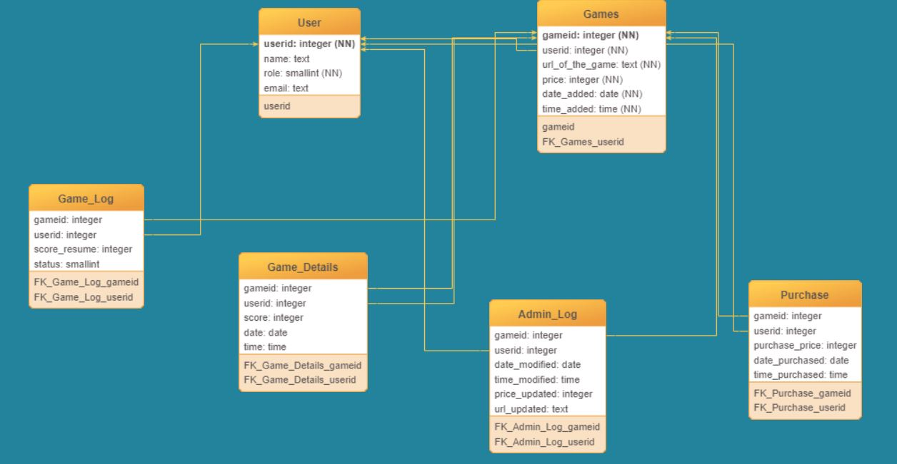

- Model User has one-to-many relationship with Model Games based on field userid.
- Model User has one-to-many relationship with Model Purchase based on field userid.
- Model User has one-to-many relationship with Model Game_Log based on field userid.
- Model User has one-to-many relationship with Model Game_Details based on field userid.
- Model User has one-to-many relationship with Model Admin_Log based on field userid.
- Model Games has one-to-many relationship with Model Purchase based on field gameid.
- Model Games has one-to-many relationship with Model Admin_Log based on field gameid.
- Model Games has one-to-many relationship with Model Game_Details based on field gameid.

## Timetables

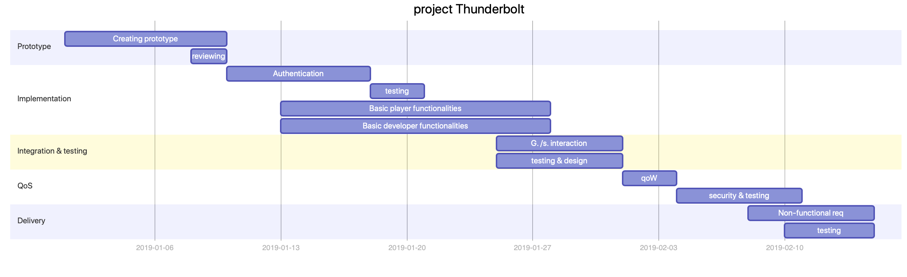

<!--
![Timetable](https://mermaidjs.github.io/mermaid-live-editor/#/view/eyJjb2RlIjoiZ2FudHRcbiAgICB0aXRsZSBwcm9qZWN0IFRodW5kZXJib2x0XG4gICAgZGF0ZUZvcm1hdCAgWVlZWS1NTS1ERFxuXG4gICAgc2VjdGlvbiBQcm90b3R5cGVcbiAgICBDcmVhdGluZyBwcm90b3R5cGUgICAgICAgICAgICAgICA6YTEsIDIwMTktMDEtMDEsIDlkXG4gICAgcmV2aWV3aW5nICAgICAgICAgICAgICAgICAgICAgICAgIDphMiwgMjAxOS0wMS0wOCwgMmRcblxuICAgIHNlY3Rpb24gSW1wbGVtZW50YXRpb25cbiAgICBBdXRoZW50aWNhdGlvbiAgICAgICAgICAgICAgICAgICAgOmIxLCAyMDE5LTAxLTEwLCA4ZFxuXG4gICAgdGVzdGluZyAgICAgICAgICAgICAgICAgICAgICAgICAgICAgICAgIDpiMiwgMjAxOS0wMS0xOCwgM2RcbiAgICBCYXNpYyBwbGF5ZXIgZnVuY3Rpb25hbGl0aWVzICAgICAgOmIzLCAyMDE5LTAxLTEzLCAxNWRcbiAgICBCYXNpYyBkZXZlbG9wZXIgZnVuY3Rpb25hbGl0aWVzICAgIDpiNCwgMjAxOS0wMS0xMywgMTVkXG5cbiAgICBzZWN0aW9uIEludGVncmF0aW9uICYgdGVzdGluZyAgICAgXG4gICAgRy4gL3MuIGludGVyYWN0aW9uICAgICAgICAgIDpjMSwgMjAxOS0wMS0yNSwgN2RcbiAgICB0ZXN0aW5nICYgZGVzaWduICAgICAgICA6YzIsIDIwMTktMDEtMjUsIDdkXG5cbiAgICBzZWN0aW9uIFFvU1xuICAgIHFvVyAgICA6eDEsIDIwMTktMDItMDEsIDNkXG4gIHNlY3VyaXR5ICYgdGVzdGluZyAgICAgOngyLCBhZnRlciB4MSwgN2RcblxuICAgIHNlY3Rpb24gRGVsaXZlcnlcbiAgICBOb24tZnVuY3Rpb25hbCByZXEgICA6eTEsIDIwMTktMDItMDgsIDdkXG4gICAgdGVzdGluZyAgICAgICAgICAgICAgICAgICAgICAgOnkyLCAyMDE5LTAyLTEwLCA1ZCIsIm1lcm1haWQiOnsidGhlbWUiOiJkZWZhdWx0In19?sanitize=true)

<!--gantt
    title project Thunderbolt
    dateFormat  YYYY-MM-DD

    section Prototype
    Creating prototype               :a1, 2019-01-01, 9d
    reviewing                         :a2, 2019-01-08, 2d

    section Implementation
    Authentication                    :b1, 2019-01-10, 8d
    Basic player functionalities      :b2, 2019-01-13, 15d
    Basic developer functionalities    :b3, 2019-01-13, 15d
    testing                                 :2019-01-28, 4d

    section Integration & testing     
    G. /s. interaction          :c1, 2019-01-25, 7d
    testing & design        :c2, 2019-01-25, 7d

    section QoS
    qoW    :x1, 2019-02-01, 3d
    testing & security     :x2, after x1, 7d

    section Delivery
    Non-functional req   :y1, 2019-02-08, 7d
    testing                       :y2, 2019-02-10, 5d-->

    1.1. - 10.1
    Prototype
    - reviewing

    10.1 - 28.1
    - Authentication
    - Basic player functionalities
    - Basic developer functionalities
    - testing

    25.1 - 31.1
    - Game/service interaction
    - testing & controlling design

    -------Milestone-----

    1.2 - 10.2
    - Checking the quality of Work
    - testing & assuring security

    08.2 - 15.2
    - Non-functional requirements
    - testing

    -----Final Delivery-----

    15.2 - 19.2
    time reserve

## Implementation Details

- Language: Python
- Framework: Django
- Database: PostgreSQL

### User authentication

- We have used **Django User authentication (Django Auth)** for authenticating the user. We have added one field (Role: Developer or Player in Django User table (CustomUser) to differentiate between the player and the developer.
- We have implemented **Email verification**. While signing up, user needs to provide a valid email address. To complete the registration, user need to confirm the email address.
- We have also implemented the password resetting using Django Administration. User can changed their password providing the email address which is used to create the account. An email notifcation for password reset will be sent to user email address.
- User can logout from the application and user can not access to any features of the application after logout. We have used **@login_required** directives to avoid authenticated access.
- We have considered that developer can not access player's account and vice versa. We have implemented it using
- We have also considered that a developer and a player can only acccess data related to themselves and not of others. 
**django.contrib.auth.decorators**.

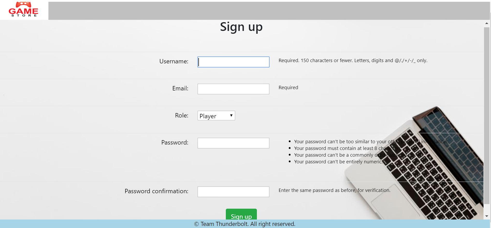
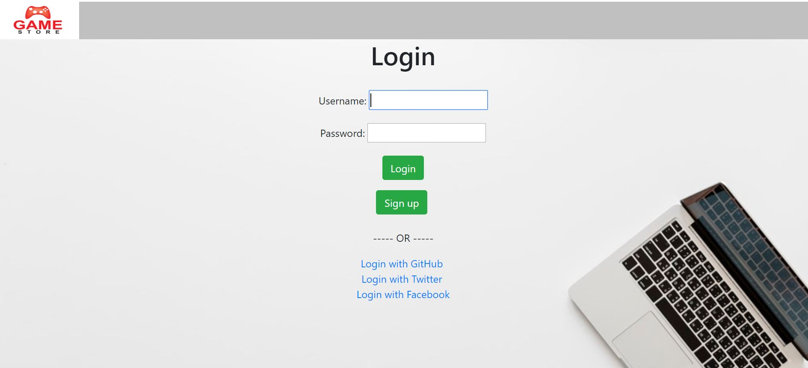

### Basic player functionalities

- Player can purchasee games from **Purchase Games** menu. If the player press the submit button, it will redirect player to the payment page when he/she can buy the game by pressing pay button or cancel the payment which will redirect player to the Purchase Games page.
- Payment process is done by the mock up payment service.
- Player can play games and submit the game score to the leaderboard. Player can also save the state of the game and load the state after saving it. Communication between the service and the game is done using **postMessage**.
- We have restricted double purchasing of a game. We have achieved it by creating composite unique key using userid(player id) and gameid. So, player can not purchase same game multiple times. 
- Players can only play the games that they have purchased.
- Players can search games in two ways, search by search bar and search by category selection. 
- We have avoided Cross Site Request Forgeries (CSRF) by applying **csrf_token** in the submission form. To prevent from XSS (Cross Site Scripting) attack, by default, Django escapes strings passed through a template variable.
- We have shown the global highest score for each game. Player will be able to see the highest score for each game they have purchased.

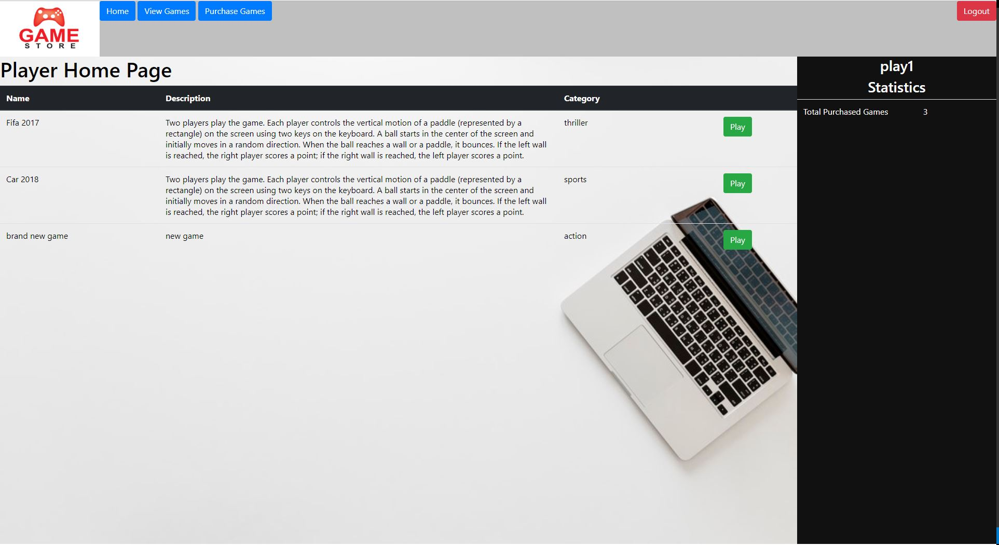
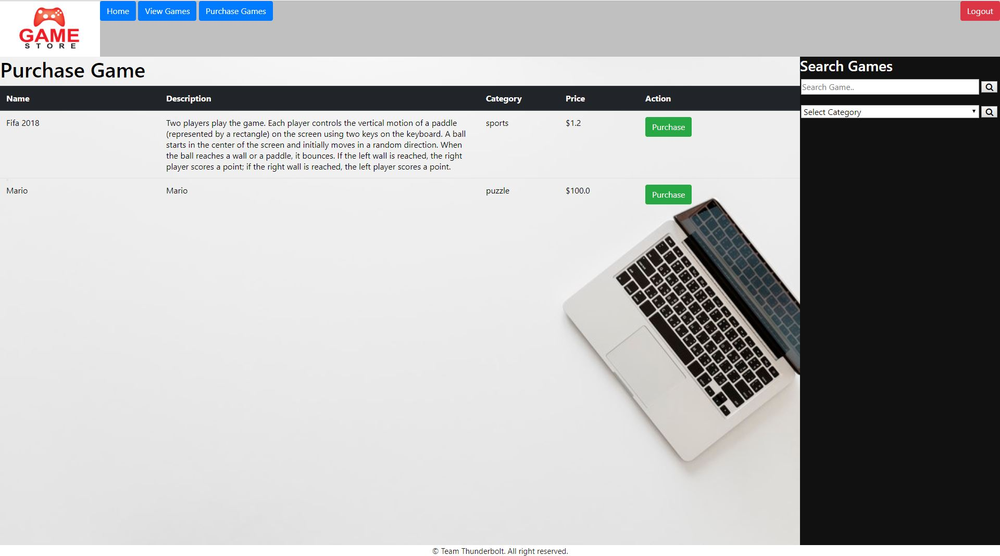
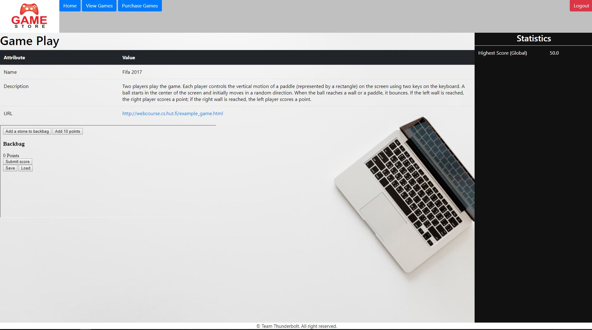

### Basic developer functionalities

- Developer can upload games by filling up the form which contains name of the game, description of the game, URL of the game, category, price.
- URL of the game must be start with http or https and negative price of the game is not allowed.
- Developer can update the information of the uploaded games.
- Developer can remove uploaded games. The game will also be removed from the purchased list of the players.

- **Issue**: 
    - While developers are removing their uploaded games, monetary issues are not considered. The player will loss their money because they purchased the game which is now removed by the developer. We did not consider this scenario in the scope of the project. But good practice is to compensate 50% to 80% money of the removed games to the players who have bought the games.

- We have provided statistics based on number of uploaded games, number of sold games, total profit, number of times each game purchased, profit made from each game.

- We have isolated developer from each other. No developer can modify or remove games of other developers. Developer only has the rights to remove and modify his/her own games.

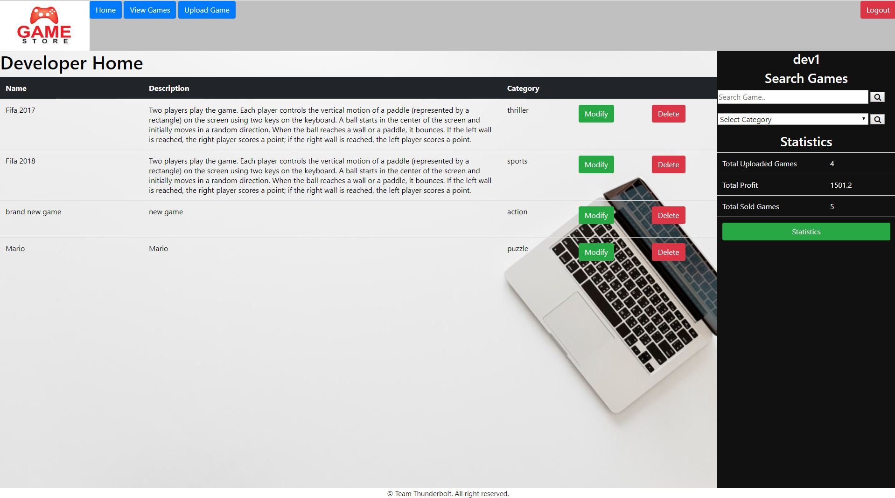
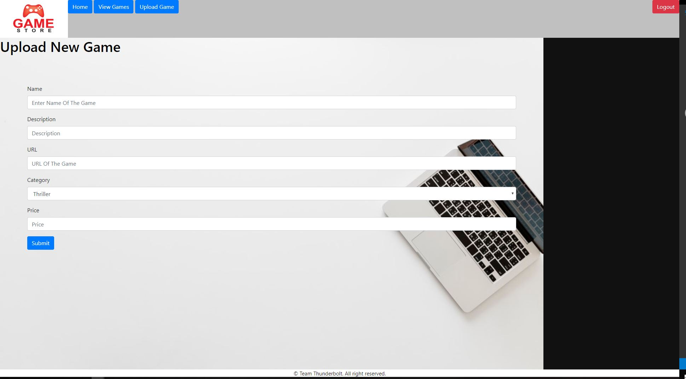
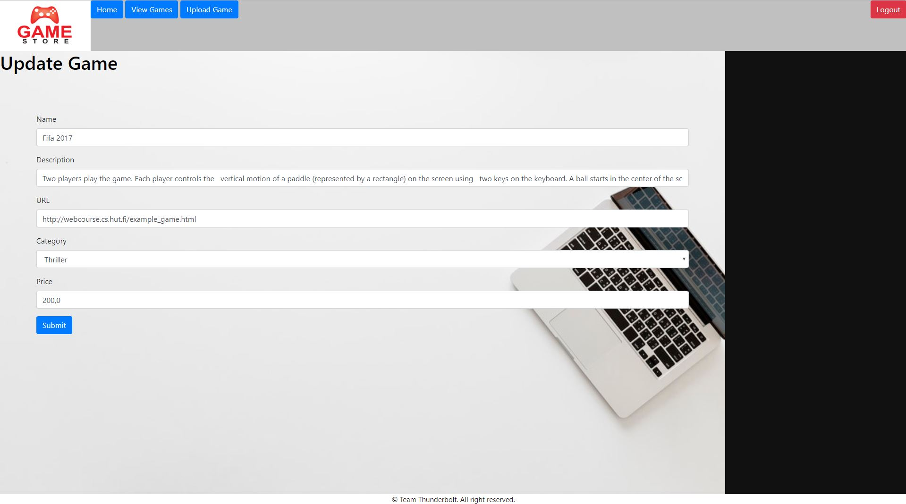
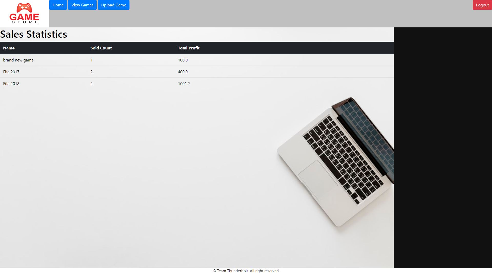

### Game/service interaction

- After playing a game, player can submit his/her score and score will be recorded in the database.
- Save button will also store the game state and score in the database.
- We have used javascript (ajax) which dynamically load the data without reloading the page for communicating between the service and the game and postMessage for passing information between the parent window and the iframe. We have implemented all the messageType mentioned in the project manual.
- When player press load button, saved state will be loaded or the appropriate error message.

### Quality of Work

- Project structure is given below:

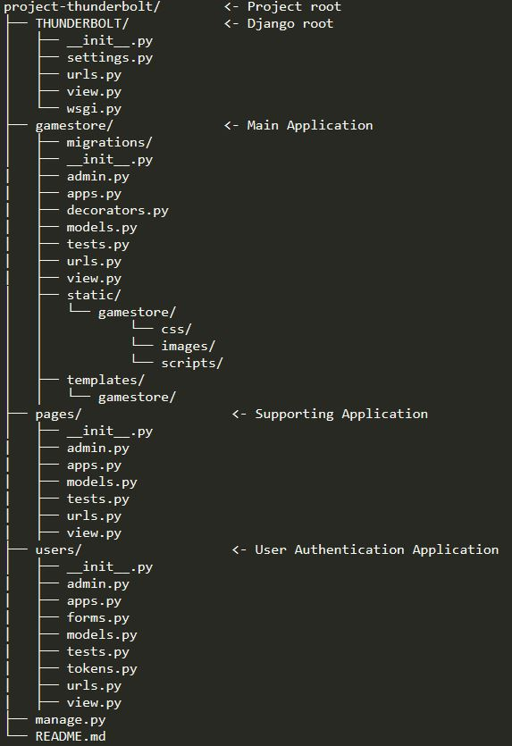

- We have mentioned the funcionality and purpose of each function using comments.
- We have followed the Model-View-Template (MVT) pattern for seperation of concerns.

### Non-functional requirements

- We have submitted the project plan at the beginning of the project initiation.
- We have worked collaborately creating branches in version.aalto git repository and divided the task equally. 

### Save/load and resolution feature

- Resolution of the iframe is set based on the provided width and height by the game.
- Game state is stored when the save button is pressed and game state can be loaded by pressing load button.

### 3rd party login

- We have implemented third part login, allowing facebook, twitter, github login to our system.

### Mobile Friendly

- We have used Bootstrap which has HTML and CSS-based design templates for forms, button and other interface component. Our application is responsive on both tradional desktop computer, laptops and mobile devices.
- Our application works with devices with varying screen width and is usable with touch based devices.

### Implementation Success and Difficulty

- **Authentication** (200/200) 
    - Success:
        - We have implemented login, logout and register with email verification.
    - Difficulty:
        - Creating custom user table and adding a custom field.

- **Basic player functionalities** (300/300)
    - Success:
        - Implemented the games and payment services and also considered the security of issues such as multiple purchase of the same game by same user.
        - We made sure that no user can take the success response and use it on another logged in user and get the game on both user and no one can change the status of the response from cancel to success and get the game for free.
    - Difficulty:
        - The payment system is sending information through GET method which comes with the URL which we can not hide.
        - Assumption: Any attacker can get the information such as pid, sid, amount through brower inspection and generate secret token by using sid as **http://payments.webcourse.niksula.hut.fi/key/** is a public link and generate checksum for purchasing the game.
        - Same as while payment system sends information through URL using GET method, attacker can get the information such as pid, reference number, result and checksum and use these to purchase the game for free.

- **Basic developer functionalities** (200/200)
    - Success:
        - We have implemented all the basic functional requirement for the game developer.
        - We have made sure that developer are only allowed to add/modify/remove their own game from their own inventory.

- **Game/service interaction** (200/200)
    - Success:
        - We have implemented all the interactions between the game and the service.
    - Difficulty:
        - Implementing interactions between the game and the service using javascript (ajax) was challenging for us. Without reloading the page, updating global highest score statistics and loading the game state were challenging.
- **Quality of Work** (80/100)
    - Success:
        - We have followed the Model-View-Template (MVT) pattern to develop the application.
        - We also commented the codes for better understandability and readability.
        - Our application is easy to use and easy to navigate.
    - Difficulty:
        - We were unable to write some test cases for automated testing.
        - But we have thoroughly tested our application creating multiple players and developers, uploading, modifying, removing, purchasing games, and play the game.
        - Our application is capable of storing the game state and loading the saved state.
- **Non-functional requirements** (200/200)
    - Success:
        - We have properly documented our code and also our documentation is self-explanatory and easy to understand the features that we have implemented and what difficulty we have faced.
        - We have also balanced our workload by distributing among team members and worked collaborately to build the final project.
        - **Arnab Rahman Chowdhury** was responsible for implementing basic player and developer functionality, Game/service interaction.
        - **Dávid Mikulovský** was responsible for user authentication, third-party login, deploying the project in Heroku.
        - **Osman Manzoor Ahmed** was responsible for creating user data models and implementing game/service interaction.

- **Save/load and resolution feature** (100/100)
    - Success:
        - Our application supports saving and loading the game state with simple messaging protocol.
        - The global highest score is also dynamically updated without reloading the page.

-  **3rd party login** (50/100)
    - Success:
        - We have implemented third part login, allowing facebook, twitter, github login to our system.

- **Mobile Friendly** (50/50)
    - Success:
        -  Our application works with devices with varying screen width and is usable with touch based devices.
    - Difficulty:
        - Styling the web application using cascading style sheets (css) and bootstrap.

### Instruction Manual

- You can access our application from the following link:
    - [Thunderbolt Gamestore](https://project-thunderbolt.herokuapp.com/)
    - Initially if you want you can these credentials for Developer:
        - username: Arnab
        - password: arnab123456
    - For Player use these credentials:
        - username: Rahman
        - password: rahman123456
    - Or you can sign Up
- User's (Player and Developer) point of view:
    - User Authentication (Login and Signup)
    - Third Party Login (GitHub, Twitter, Facebook)
    - Reset the password from Login page
        - resetting the password will require valid email address which is used for registration

- Developer's point of view:
    - Home Page 
        - Developer can launch gamestore/logout/reset the password
    - View Games
        - Developer will be able to see the uploaded games
        - Developer can modify/remove the games
        - Developer can also check the statistics of the sold games and profit earned from each game.
    - Upload Games
        - Developer can upload games

- Player's point of view:
    - Home Page
        - Player can launch gamestore/logout/reset the password
    - View Games
        - player can view the purchased games
        - play the games
        - check the global highest score of each purchased games
    - Purchase Games:
        - player can purchase game

### Extra Information

- The heroku website that we have provided is secured and is using the protocol HTTPS. The game that is uploaded is HTTP and to run the HTTP game over HTTPS you need to change the HTTPS to HTTP. Oterwise you will get pop ups that will be basically blocking the game.

- As an extra I guess we have implemented the password reset functionality.